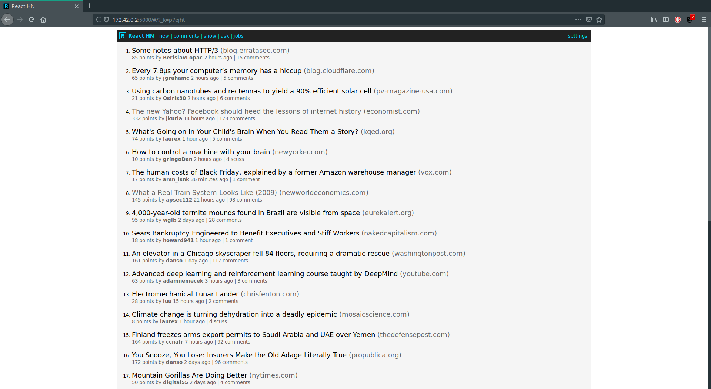

# **Roger skyline (part I)**

42 (Paris)

### **Description**

This is just a prototype to quickly test the assignments of the `roger-skyline-1` project
using `docker` and `docker-compose`.

### **Usage**

Executing the `run.sh` script docker will: 

+ build the image from the `Dockerfile` 
+ create the bridge network from the `network.sh` script
+ deploy the `react` version of [Hacker News](https://news.ycombinator.com/) with `docker-compose`

### Network

To see the running service fire up your browser at `172.42.0.2:5000` et voilà your **Hacker News** client is served.

+ Source: [react-hn](https://github.com/insin/react-hn)

### Reference

+ [Safer bash scripts with 'set -euxo pipefail'](https://vaneyckt.io/posts/safer_bash_scripts_with_set_euxo_pipefail/)
+ [Protect Linux server against DOS attacks with ufw](http://lepepe.github.io/sysadmin/2016/01/19/ubuntu-server-ufw.html)
+ [Survive DDOS attack with Nginx and fail2ban](https://easyengine.io/tutorials/nginx/fail2ban/)

---

Happy hacking!

### **License**

This work is published under the terms of [42 Unlicense](https://github.com/gcamerli/42unlicense).
